# Architecture

## Pipeline overview

```mermaid
%%{init: {"themeVariables": {"fontSize": "24px"}}}%%
flowchart TD
    Start([Start]) --> S["**Node 0 (function)**\nTell the user the system\nis starting up"]

    S --> Z["**Node 0a (function)**\nLaunch a persistent headless Chromium\ncontext via Playwright (reused across job URLs,\nnot relaunched per extraction)"]

    Z --> N["**Node 0b (function)**\nAsk the user: add a new job entry,\nor close out the agent system?"]

    N --> M{"**Node 0c (routing function)**\nDid the user choose to add\na new job entry?"}

    M -- "Yes" --> R{"**Node 0e (routing function)**\nAre drive/folder/workbook/sheet\ndetails already defined in `config.json` file?"}

    M -- "No" --> X["**Node 0d (function)**\nClose the persistent Playwright\nChromium context and halt\nthe agent system"]

    X --> Fin([Halted])

    R -- "Defined" --> W["**Node 0f (function)**\nLoad drive/folder/workbook/sheet/header\ndetails from `config.json` into Context"]

    W --> F["**Node 11 (function)**\nAsk user for the page URL (job posting)"]

    R -- "Not defined" --> A["**Node 1 (agent)**\nUse Composio MCP server to list\nthe OneDrive drives available\nto the user"]

    A --> A2["**Node 2 (function)**\nAsk user which OneDrive\ndrive to use"]

    A2 --> C["**Node 5 (agent)**\nUse Composio MCP server to list spreadsheets\n(.xlsx, .xlsm, or .xls) in the root folder\nof the chosen drive and return their names to the user"]

    C --> C2["**Node 6 (function)**\nAsk user which workbook to use"]

    C2 --> D["**Node 7 (agent)**\nRetrieve the sheets within the selected workbook\nand return the sheet names to the user"]

    D --> D2["**Node 8 (function)**\nAsk user which sheet to use"]

    D2 --> E["**Node 9 (agent)**\nRetrieve the column headers\nof the selected sheet"]

    E --> K["**Node 10 (function)**\nWrite a new `config.json` file on the user's system\nstating the selected drive, folder, workbook,\nsheet and sheet headers"]

    K --> F

    F --> G["**Node 12 (agent + function)**\nNavigate to the job page and extract\ncontent matching the sheet's column\nheaders retrieved from context into an in-memory record"]

    G --> Q{"**Node 13 (routing function)**\nConfidence check on mapped record\n(StringRoute)"}

    Q -- "Confident" --> I["**Node 14 (agent)**\nAccess the selected sheet\nand write the in-memory record\nas a new row via Composio MCP server"]

    I --> L["**Node 15 (function)**\nTell the user that the spreadsheet\nhas been updated"]

    L -.-> LB(["Next job entry:\nback to Node 12"])

    Q -- "Low confidence /\nmissing fields" --> RT(["Retry Node 12\n(max 2x)"])

    classDef terminal fill:#f1f3f4,stroke:#5f6368,stroke-width:1px,color:#5f6368,font-size:24px
    classDef process fill:#e8f0fe,stroke:#bdc1c6,stroke-width:1px,color:#202124,font-size:24px
    classDef decision fill:#fef7e0,stroke:#f9ab00,stroke-width:1px,color:#202124,font-size:24px

    class Start,Fin,RT,LB terminal
    class S,Z,N,X,A,A2,C,C2,D,D2,E,F,G,I,K,L,W process
    class R,Q,M decision

    linkStyle default stroke:#595959,stroke-width:1px
```

## Node summary

| #   | Type                    | Responsibility                                                                                                                                                                                                                   |
| --- | ----------------------- | -------------------------------------------------------------------------------------------------------------------------------------------------------------------------------------------------------------------------------- |
| 0   | Python function         | Tells the user the agent system is starting up                                                                                                                                                                                   |
| 0a  | Python function         | Launches a persistent headless Chromium context via Playwright once, kept alive and reused across job URL extractions instead of relaunching per call                                                                            |
| 0b  | Python function         | Asks the user whether they want to add a new job entry or close out the agent system                                                                                                                                             |
| 0c  | Routing (function)      | Checks the user's response from node 0b via StringRoute; routes to the existing folder/workbook/sheet/sheet headers config-check routing if adding an entry, or to node 0d if closing out                                        |
| 0d  | Python function         | Closes the persistent Playwright Chromium context and halts the agent ADK system                                                                                                                                                 |
| 0e  | Routing (function)      | Checks whether drive/folder/workbook/sheet/sheet header details are already defined in the `config.json` file; routes to node 0f if defined, or to node 1 to begin the setup flow if not                                                  |
| 0f  | Python function         | Loads the drive/folder/workbook/sheet/sheet header details from `config.json` into Context (`ctx.state`) so downstream nodes can read them the same way they would after the setup flow                                        |
| 1   | Agent                   | Uses the Composio MCP server to list the OneDrive drives available to the user                                                                                                                                                   |
| 2   | Python function         | Asks the user which OneDrive drive to use                                                                                                                                                                                        |
| 5   | Agent                   | Uses the Composio MCP server to list the spreadsheets (.xlsx, .xlsm, or .xls) found in the root folder of the chosen drive and returns their names to the user                                                                   |
| 6   | Python function         | Asks the user which workbook to use                                                                                                                                                                                              |
| 7   | Agent                   | Retrieves the sheets within the selected workbook and returns the sheet names to the user                                                                                                                                        |
| 8   | Python function         | Asks the user which sheet to use                                                                                                                                                                                                 |
| 9   | Agent                   | Retrieves the column headers of the selected sheet via the Composio MCP server                                                                                                                                                   |
| 10  | Python function         | Writes a new `config.json` file on the user's system summarising the selected drive, folder, spreadsheet name, sheet name and column headers                                                                                            |
| 11  | Python function         | Asks the user for the page URL (job posting) to extract                                                                                                                                                                          |
| 12  | Agent + Python function | Given a page URL and the sheet's column headers retrieved from context, reuses the persistent Chromium context to navigate to the page, extract the job-description content relevant to those fields, and build an in-memory record keyed by each field |
| 13  | Routing (function)      | Checks confidence of the mapped record via a StringRoute; on low confidence or missing fields, routes back to node 12 to retry extraction (capped at 2 retries); otherwise proceeds to node 14                                   |
| 14  | Agent                   | Writes the in-memory record to the selected sheet as a new row                                                                                                                                                                   |
| 15  | Python function         | Tells the user that the spreadsheet has been updated                                                                                                                                                                             |

