# Architecture

## Pipeline overview

```mermaid
%%{init: {"themeVariables": {"fontSize": "24px"}}}%%
flowchart TD
    Start([Start]) --> S["**Node 0 (function)**\nTell the user the system\nis starting up"]

    S --> Z["**Node 0a (function)**\nLaunch a persistent headless Chromium\ncontext via Playwright (reused across job URLs,\nnot relaunched per extraction)"]

    Z --> N["**Node 0b (function)**\nAsk the user: add a new job entry,\nor close out the agent system?"]

    N --> M{"**Node 0c (routing function)**\nDid the user choose to add\na new job entry?"}

    M -- "Yes" --> R{"**Node 0e (routing function)**\nAre drive/folder/workbook/sheet\ndetails already defined in `config.json` file?"}

    M -- "No" --> X["**Node 0d (function)**\nClose the persistent Playwright\nChromium context and halt\nthe agent system"]

    X --> Fin([Halted])

    R -- "Defined" --> W["**Node 0f (function)**\nLoad drive/folder/workbook/sheet/header\ndetails from `config.json` into Context"]

    W --> F["**Node 9 (function)**\nAsk user for the page URL (job posting)"]

    R -- "Not defined" --> CO["**Node 0g (function)**\nVerify the user's OneDrive/Excel\nComposio connections are active;\nif not, surface a reauth link and\nblock until the user completes it"]

    CO --> A["**Node 1 (agent)**\nUse Composio MCP server to list\nthe OneDrive drives available\nto the user"]

    A --> A2["**Node 2 (function)**\nAsk user which OneDrive\ndrive to use"]

    A2 --> FN1["**Node 2a (function)**\nResolve the chosen drive to an id\nand reset folder navigation to the drive root"]

    FN1 --> FN2["**Node 2b (agent)**\nUse Composio MCP server to list the\nsubfolders and workbook files\nof the current folder"]

    FN2 --> FN2R{"**Node 2c (routing function)**\nWas the folder-listing agent's\nresponse valid JSON?"}

    FN2R -- "Malformed (retry)" --> FN2

    FN2R -- "Valid JSON" --> FN3["**Node 2d (function)**\nAsk user to open a listed subfolder,\ngo up a level, or pick a\nlisted workbook"]

    FN3 --> FN4{"**Node 2e (routing function)**\nApply the user's choice: update the\ncurrent folder path, or record the\npicked workbook as the final selection"}

    FN4 -- "Navigate\n(into a subfolder or up a level)" --> FN2

    FN4 -- "Select a workbook" --> D["**Node 5 (agent)**\nRetrieve the sheets within the selected workbook\nand return the sheet names to the user"]

    D --> D2["**Node 6 (function)**\nAsk user which sheet to use"]

    D2 --> E["**Node 7 (agent)**\nRetrieve the column headers\nof the selected sheet"]

    E --> K["**Node 8 (function)**\nWrite a new `config.json` file on the user's system\nstating the selected drive, folder, workbook,\nsheet and sheet headers"]

    K --> KV{"**Node 8a (routing function)**\nRe-read `config.json` back to confirm\nthe write succeeded"}

    KV -- "Verified" --> F

    KV -- "Verification failed" --> A

    F --> G["**Node 10 (agent)**\nNavigate to the job page and extract\ncontent matching the sheet's column\nheaders retrieved from context into an in-memory record"]

    G --> G2{"**Node 10a (routing function)**\nWas the extraction agent's\nresponse valid JSON?"}

    G2 -- "Malformed\n(retry, max 2x)" --> G

    G2 -- "Valid JSON" --> V["**Node 11 (agent)**\nIndependently re-visit the job page and\nfact-check every extracted value, flagging\nanything missing, contradicted, or fabricated"]

    V --> Q{"**Node 11a (routing function)**\nDid verification pass?\n(checks `is_valid` on the\nverifier agent's output)"}

    Q -- "Passed" --> I["**Node 12 (agent)**\nAccess the selected sheet\nand write the in-memory record\nas a new row via Composio MCP server"]

    Q -- "Failed\n(feed issues back to Node 10,\nretry, max 2x)" --> G

    I --> L["**Node 13 (function)**\nTell the user that the spreadsheet\nhas been updated"]

    L --> Fin2([Done])

    classDef terminal fill:#f1f3f4,stroke:#5f6368,stroke-width:1px,color:#5f6368,font-size:24px
    classDef process fill:#e8f0fe,stroke:#bdc1c6,stroke-width:1px,color:#202124,font-size:24px
    classDef decision fill:#fef7e0,stroke:#f9ab00,stroke-width:1px,color:#202124,font-size:24px

    class Start,Fin,Fin2 terminal
    class S,Z,N,X,A,A2,FN1,FN2,FN3,CO,D,D2,E,F,G,I,K,L,V,W process
    class R,Q,M,KV,G2,FN2R,FN4 decision

    linkStyle default stroke:#595959,stroke-width:1px
```

## Node summary

| #   | Type                    | Responsibility                                                                                                                                                                                                                   |
| --- | ----------------------- | -------------------------------------------------------------------------------------------------------------------------------------------------------------------------------------------------------------------------------- |
| 0   | Python function         | Tells the user the agent system is starting up                                                                                                                                                                                   |
| 0a  | Python function         | Launches a persistent headless Chromium context via Playwright once, kept alive and reused across job URL extractions instead of relaunching per call                                                                            |
| 0b  | Python function         | Asks the user whether they want to add a new job entry or close out the agent system                                                                                                                                             |
| 0c  | Routing (function)      | Checks the user's response from node 0b via StringRoute; routes to the existing folder/workbook/sheet/sheet headers config-check routing if adding an entry, or to node 0d if closing out. On unrecognized input, re-prompts by looping back to node 0b instead of routing forward |
| 0d  | Python function         | Closes the persistent Playwright Chromium context and halts the agent ADK system                                                                                                                                                 |
| 0e  | Routing (function)      | Checks whether drive/folder/workbook/sheet/sheet header details are already defined in the `config.json` file; routes to node 0f if defined, or to node 0g to begin the setup flow if not                                                  |
| 0f  | Python function         | Loads the drive/folder/workbook/sheet/sheet header details from `config.json` into Context (`ctx.state`) so downstream nodes can read them the same way they would after the setup flow. On a read/parse failure it retries itself, capped at 2 attempts (`MAX_CONFIG_LOAD_ATTEMPTS`), then gives up and proceeds to node 9 anyway rather than looping forever |
| 0g  | Python function         | Verifies the user's OneDrive/Excel Composio connections are active before the setup flow calls any Composio tool; if a toolkit isn't connected, surfaces a reauth link and blocks until the user completes it                  |
| 1   | Agent                   | Uses the Composio MCP server to list the OneDrive drives available to the user                                                                                                                                                   |
| 2   | Python function         | Asks the user which OneDrive drive to use                                                                                                                                                                                        |
| 2a  | Python function         | Resolves the user-picked drive name to an id and resets folder navigation (`current_folder_path`) back to the drive root, so a re-selected drive doesn't inherit a stale folder from a previous pass through this loop        |
| 2b  | Agent                   | Uses the Composio MCP server (`ONE_DRIVE_LIST_FOLDER_CHILDREN`) to list the current folder's subfolders and workbook files (.xlsx, .xlsm, or .xls), tagging each as folder or workbook (`is_folder`) with the workbook's full drive path included                                    |
| 2c  | Routing (function)      | Checks whether node 2b's response was valid JSON; on malformed output, routes back to node 2b to retry, otherwise proceeds to node 2d                                                                                            |
| 2d  | Python function         | Asks the user to open a listed subfolder, go up one level (omitted at the drive root), or pick a listed workbook (.xlsx, .xlsm, or .xls) to select it                                                                            |
| 2e  | Routing (function)      | Applies the user's choice from node 2d: descending into a subfolder or going up a level updates `current_folder_path` (tracked as a plain string, not resolved via a parent-lookup API call) and loops back to node 2b to re-list the new current folder's children; picking a workbook records `selected_folder_path`/`selected_workbook_id`/`selected_workbook_name`/`selected_workbook_path` from the already-retrieved node 2b listing (no separate workbook-lookup call) and proceeds directly to node 5 |
| 5   | Agent                   | Retrieves the sheets within the selected workbook and returns the sheet names to the user                                                                                                                                        |
| 6   | Python function         | Asks the user which sheet to use                                                                                                                                                                                                 |
| 7   | Agent                   | Retrieves the column headers of the selected sheet via the Composio MCP server                                                                                                                                                   |
| 8   | Python function         | Writes a new `config.json` file on the user's system summarising the selected drive, folder path, spreadsheet name, sheet name and column headers                                                                                       |
| 8a  | Routing (function)      | Re-reads `config.json` to confirm the write in node 8 actually persisted the required fields; on failure routes back to node 1 to restart the whole setup flow, otherwise proceeds to node 9                                   |
| 9   | Python function         | Asks the user for the page URL (job posting) to extract. On an invalid (non-`https://`) URL, re-prompts itself instead of routing forward                                                                                       |
| 10  | Agent                   | Given a page URL and the sheet's column headers retrieved from context, reuses the persistent Chromium context to navigate to the page, extract the job-description content relevant to those fields, and build an in-memory record keyed by each field |
| 10a | Routing (function)      | Checks whether node 10's response was valid JSON; on malformed output, routes back to node 10 to retry (capped at 2 retries), otherwise proceeds to node 11                                                                     |
| 11  | Agent                   | Independently re-navigates to the job page and fact-checks every value in node 10's record against the live page content, flagging anything missing, contradicted, or that looks fabricated/guessed                            |
| 11a | Routing (function)      | Checks the verifier agent's `is_valid` result; on failure, feeds the specific issues back into node 10's prompt and routes back to node 10 to retry (capped at 2 retries); otherwise proceeds to node 12                        |
| 12  | Agent                   | Writes the in-memory record to the selected sheet as a new row. If the response isn't valid JSON, retries itself, capped at 2 retries (`MAX_WRITE_ATTEMPTS`), before proceeding to node 13                                     |
| 13  | Python function         | Tells the user that the spreadsheet has been updated. The workflow ends here for this run — there is currently no edge looping back to node 9/10 for another job entry                                                          |

