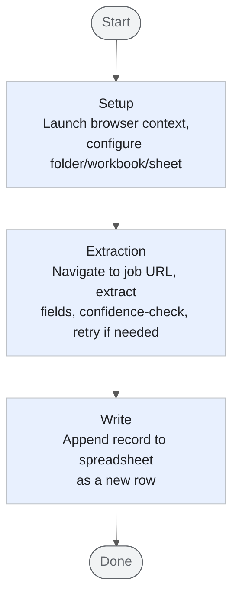

# Job Advert Recorder Agent

[](https://www.python.org/)
[](https://docs.pydantic.dev/latest/)
[](https://adk.dev/2.0/)
[](https://playwright.dev/)
[](https://composio.dev/toolkits/excel/framework/google-adk)
[](https://docs.astral.sh/ruff/)
[](https://microsoft.github.io/pyright/)
[](https://docs.astral.sh/uv/)
[](https://pre-commit.com/)
[](https://github.com/tmbo/questionary)

<!-- Add demo gif here -->

**Never worry about manually copy pasting job advert details into spreadsheets again!**

Job Advert Recorder Agent is a [graph-based](https://adk.dev/graphs/) agent pipeline using [Google ADK 2.0](https://adk.dev/2.0/) that extracts job description data from a URL and writes it into a row of a user's spreadsheet, auto-filling the relevant cell entries.
<br><br>
The tool is operated via the CLI, [see below for setup instructions](#local-setup).

## Contents

- [Project Overview](#project-overview)
    - [Pipeline Overview](#pipeline-overview)
- [How to Use](#how-to-use)
    - [Tracking a Different Workbook, Sheet or Columns](#tracking-a-different-workbook-sheet-or-columns)
- [Local Setup](#local-setup)
- [Development](#development)
- [Current Limitations](#current-limitations)

## Project Overview

The Job Advert Recorder Agent system is written in the [Python SDK for Google ADK 2.0](https://github.com/google/adk-python).

When the agent system starts up for the first time, [Playwright](https://playwright.dev/) installs the [Chromium](https://www.chromium.org/getting-involved/download-chromium/) browser for reuse (headless mode) across subsequent runs of the pipeline.

Immediately after, the user is prompted for the excel workbook and sheet they want to use through the aid of the [Composio MCP Server](https://composio.dev/).

The user can also specify an optional folder within OneDrive to scope the search for excel workbooks within to reduce search latency.
These details are then saved to a config file (`config.json`), and the user is asked for the URL of the job posting to scrape details from.

A series of agents then extracts & vets the content retrieved adheres to what is expected (i.e. the column header names of your workbook sheet).
If everything is looking right, then the Composio MCP Server adds a new row to your workbook sheet, auto-filling out the cell entries!

### Pipeline Overview



For the full node-by-node flowchart and node summary table, see [ARCHITECTURE.md](ARCHITECTURE.md).

## How to Use

> Requires the project to be [set up locally](#local-setup) first.

1. Activate your virtual env and run `uv run python run_cli_select.py .` (see step 6 of [Local Setup](#local-setup)) to start the agent.
2. On first run, you'll be prompted to pick a OneDrive folder, workbook, and sheet to track - these choices are cached in `config.json` so you won't be asked again on subsequent runs (unless you want to [track a different workbook/sheet](#tracking-a-different-workbook-sheet-or-columns)).
3. Paste in the URL of the job posting you want to record.
4. The agent extracts the job details, checks them against your sheet's column headers, and appends a new row to your spreadsheet - auto-filling the matching cells.

### Tracking a Different Workbook, Sheet or Columns

Once the initial setup flow has run once, the selected OneDrive folder, workbook, sheet, and sheet column headers are cached in a `config.json` file so they don't need to be re-selected on every run.

There is currently no CLI-based way to change these once set (see [Current Limitations](#current-limitations)) - to point the agent at a different workbook, sheet, or set of columns, you have to manually edit (or delete) `config.json` yourself:

- Edit the relevant field(s) directly to switch workbook/sheet/columns.
- Alternatively, delete `config.json` entirely to re-trigger the full setup flow (folder → workbook → sheet → column headers) on the next run.

Proper CLI-based config management is planned to prevent the need for this in future.

## Local Setup


1). Create and navigate to a `job_tracker_agent` directory, then set up a virtual env for package management

```powershell
# Create and navigate to new folder to clone repo within
mkdir job_tracker_agent
cd job_tracker_agent

python -m venv .venv # Create a new virtual env

.venv\Scripts\python.exe -m pip install uv # Install uv into the venv

```

2). Activate the virtual env

```powershell
.venv\Scripts\Activate.ps1 # Activate the virtual env

```
3). Clone repo and install packages

```powershell

git clone https://github.com/cyprste2717218/job_advert_recorder_agent/ .

uv lock # Install pinned package versions

```

4). Copy `.env.example` to `.env`:

```powershell
cp .\.env.example .\.env
```

5). Setup your accounts & API keys:

5a). Go to [Google AI Studio](https://aistudio.google.com/app/apikey), create an API Key under a new or existing project & write it to your `.env` under `GOOGLE_API_KEY`

5b). Get your Composio API key and User ID
- Log in to the [Composio dashboard](https://dashboard.composio.dev/login).
- Go to the **API Keys** section and click **Create API Key** (top right). When creating the key, make sure the following scopes are enabled - the agent's Excel/OneDrive MCP calls and session management will fail with auth errors if any are missing:

  - Tools (Read)
  - Tool Execution (Write)
  - Sessions (Write)
  - Connected Accounts (Read & Write)
  - Auth Configs (Read & Write)
  - Toolkits (Read & Write)

- Copy the generated key and write it to `COMPOSIO_API_KEY` in `.env`.
- Decide on a stable user identifier to scope sessions, in this system a username would make sense ([see Composio's Guidance on why here](https://docs.composio.dev/docs/how-composio-works#:~:text=A%20user%20is%20an%20identifier%20from%20your%20app.%20Composio%20stores%20connections%20under%20that%20ID%2C%20so%20tools%20run%20with%20the%20right%20account%20and%20stay%20isolated%20from%20other%20users.%20Use%20a%20stable%20identifier%20like%20your%20database%20ID%2C%20never%20one%20that%20can%20change.)). Use this for `COMPOSIO_USER_ID` in `.env`.

> Note: this dashboard flow is accurate as of 11/08/2026 and may drift if Composio changes their UI - worth a quick sanity check against the live dashboard if the steps above don't match what you see.

5c). (Optional) Change the `MODEL` env variable in `.env` to [another gemini model](https://ai.google.dev/gemini-api/docs/models) for use across agents, i.e. temporary service unavailability with the current model. 
Ideally should be another non-frontier model as anything else is overkill for the current system.

6). Start the agent system!

```bash
uv run python run_cli_select.py .
```

`run_cli_select.py` is a drop-in replacement for `adk run` - it delegates to ADK's own CLI runner (all of ADK's flags, session persistence, etc. still work) but swaps the plain `input()` prompt for an interactive `questionary` select/multi-select/checkbox UI.

## Development

Linting/formatting is handled by [Ruff](https://docs.astral.sh/ruff/), and static type checking by [Pyright](https://microsoft.github.io/pyright/).

```bash
uv sync --group dev   # Install dev dependencies

ruff check --fix .    # Lint
ruff format .          # Format
pyright                # Type check
```

Optionally, install the pre-commit hooks to run these automatically before each commit:

```bash
pre-commit install
```

## Current Limitations

- **Incompatible with LinkedIn job postings**

  LinkedIn has [very strict anti-bot measures](https://www.linkedin.com/help/linkedin/answer/a1341387) in place which make it tricky (even in authenticated LinkedIn sessions) to extract web content, in this case via a headless Playwright session.
  The most practical solution to this is to build a web extension (i.e. Chrome extension) which won't face the same barriers faced by automated access.

- **Token/performance cost of Composio MCP server**

  While opted for to avoid having to handle/implement auth with the [Microsoft Graph API](https://developer.microsoft.com/en-us/graph) (which exposes functionality for interacting with Excel workbooks among other things), using the Composio MCP server invokes an agent to do otherwise deterministic operations, increasing token usage and incurring potential network/performance delays.
  The solution to this is to implement a light API layer around the Microsoft Graph API alongside necessary auth handling at a later date.

- **No CLI support for changing config details (active workbook, sheet etc.)**

  To work with a different workbook and sheet, the `config.json` file has to be manually edited.
  The solution is to implement user-based input handling in the system to handle updating these details.
