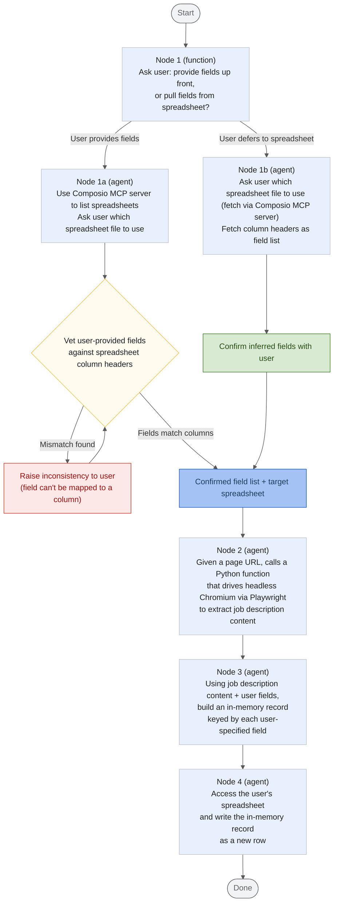

# Job Advert Recorder Agent

Never worry about manually copy pasting job advert details into spreadsheets again!

Job Advert Recorder Agent is a graph-based agent pipeline using [Google ADK 2.0](https://adk.dev/2.0/) that extracts job description data from a URL and writes it into a row of a user's spreadsheet, auto-filling the relevant cell entries.
The user supplies field definitions for their spreadsheet up front or they are inferred by an agent from the spreadsheet's existing columns.

## Local Setup

## Pipeline overview

## Node summary

| #   | Type                    | Responsibility                                                                                                                                                                                                                                                   |
| --- | ----------------------- | ---------------------------------------------------------------------------------------------------------------------------------------------------------------------------------------------------------------------------------------------------------------- |
| 1   | Python function         | Asks the user whether to supply data fields up front or derive them from the spreadsheet; branches accordingly                                                                                                                                                   |
| 1a  | Agent                   | Uses the Composio MCP server to list available spreadsheets, asks the user to pick one, then vets the user-supplied fields against that spreadsheet's actual column headers — flagging any mismatches so extracted data can't silently fail to map onto a column |
| 1b  | Agent                   | Asks the user which spreadsheet to use, fetches its column headers directly as the field list, and confirms with the user before proceeding                                                                                                                      |
| 2   | Agent + Python function | Given a page URL, drives headless Chromium via Playwright to navigate to the page and extract all job-description-related content                                                                                                                                |
| 3   | Agent                   | Combines the extracted job description with the confirmed field list to build an in-memory record, one value per user-specified field                                                                                                                            |
| 4   | Agent                   | Writes the in-memory record to the user's spreadsheet as a new row                                                                                                                                                                                               |

