# Job Advert Recorder Agent

Never worry about manually copy pasting job advert details into spreadsheets again!

Job Advert Recorder Agent is a [graph-based](https://adk.dev/graphs/) agent pipeline using [Google ADK 2.0](https://adk.dev/2.0/) that extracts job description data from a URL and writes it into a row of a user's spreadsheet, auto-filling the relevant cell entries.
The user supplies field definitions for their spreadsheet up front or they are inferred by an agent from the spreadsheet's existing columns.

## Local Setup

## Pipeline overview

```mermaid
flowchart TD
    Start([Start]) --> R{"Routing (function)\nAre folder/workbook/sheet\ndetails already defined in config file?"}

    R -- "Defined" --> F["Node 8 (function)\nAsk user for the page URL (job posting)"]

    R -- "Not defined" --> A["Node 1 (function)\nAsk user which folder in their OneDrive\nto look in for Excel workbooks"]

    A --> B["Node 2 (agent)\nUse Composio MCP server to list spreadsheets\nin that folder and return their names to the user"]

    B --> C["Node 3 (function)\nAsk user which workbook to use"]

    C --> D["Node 4 (agent)\nRetrieve the sheets within the selected workbook\nand return the sheet names to the user"]

    D --> E["Node 5 (function)\nAsk user which sheet to use"]

    E --> J["Node 6 (function)\nRetrieve the column headers\nof the selected sheet"]

    J --> K["Node 7 (function)\nWrite a new config file on the user's system\nstating the selected folder, workbook,\nand sheet"]

    K --> F

    F --> G["Node 9 (agent + function)\nGiven a page URL, calls a Python function\nthat drives headless Chromium via Playwright\nto extract job description content"]

    G --> H["Node 10 (agent)\nUsing job description content + the selected sheet's fields,\nbuild an in-memory record\nkeyed by each field"]

    H --> I["Node 11 (agent)\nAccess the selected sheet\nand write the in-memory record\nas a new row via Composio MCP server"]

    I --> L["Node 12 (function)\nTell the user that the spreadsheet\nhas been updated"]

    L --> End([Done])

    classDef terminal fill:#f1f3f4,stroke:#5f6368,stroke-width:1px,color:#5f6368
    classDef process fill:#e8f0fe,stroke:#bdc1c6,stroke-width:1px,color:#202124
    classDef decision fill:#fef7e0,stroke:#f9ab00,stroke-width:1px,color:#202124

    class Start,End terminal
    class A,B,C,D,E,F,G,H,I,J,K,L process
    class R decision

    linkStyle default stroke:#595959,stroke-width:1px
```

## Node summary

| #   | Type                    | Responsibility                                                                                                                                                                                                                                                   |
| --- | ----------------------- | ---------------------------------------------------------------------------------------------------------------------------------------------------------------------------------------------------------------------------------------------------------------- |
| 1   | Python function         | Asks the user which folder in their OneDrive to look in for Excel workbooks                                                                                                                                                                                       |
| 2   | Agent                   | Uses the Composio MCP server to list the spreadsheets found in that folder and returns their names to the user                                                                                                                                                    |
| 3   | Python function         | Asks the user which workbook to use                                                                                                                                                                                                                                |
| 4   | Agent                   | Retrieves the sheets within the selected workbook and returns the sheet names to the user                                                                                                                                                                         |
| 5   | Python function         | Asks the user which sheet to use                                                                                                                                                                                                                                   |
| 6   | Python function         | Retrieves the column headers of the selected sheet                                                                                                                                                                                                                 |
| 7   | Python function         | Writes a new config file on the user's system summarising the selected folder, spreadsheet name, and sheet name                                                                                                                                                   |
| 8   | Python function         | Asks the user for the page URL (job posting) to extract                                                                                                                                                                                                            |
| 9   | Agent + Python function | Given a page URL, drives headless Chromium via Playwright to navigate to the page and extract all job-description-related content                                                                                                                                |
| 10  | Agent                   | Combines the extracted job description with the selected sheet's fields to build an in-memory record, one value per field                                                                                                                                        |
| 11  | Agent                   | Writes the in-memory record to the selected sheet as a new row                                                                                                                                                                                                     |
| 12  | Python function         | Tells the user that the spreadsheet has been updated                                                                                                                                                                                                               |

